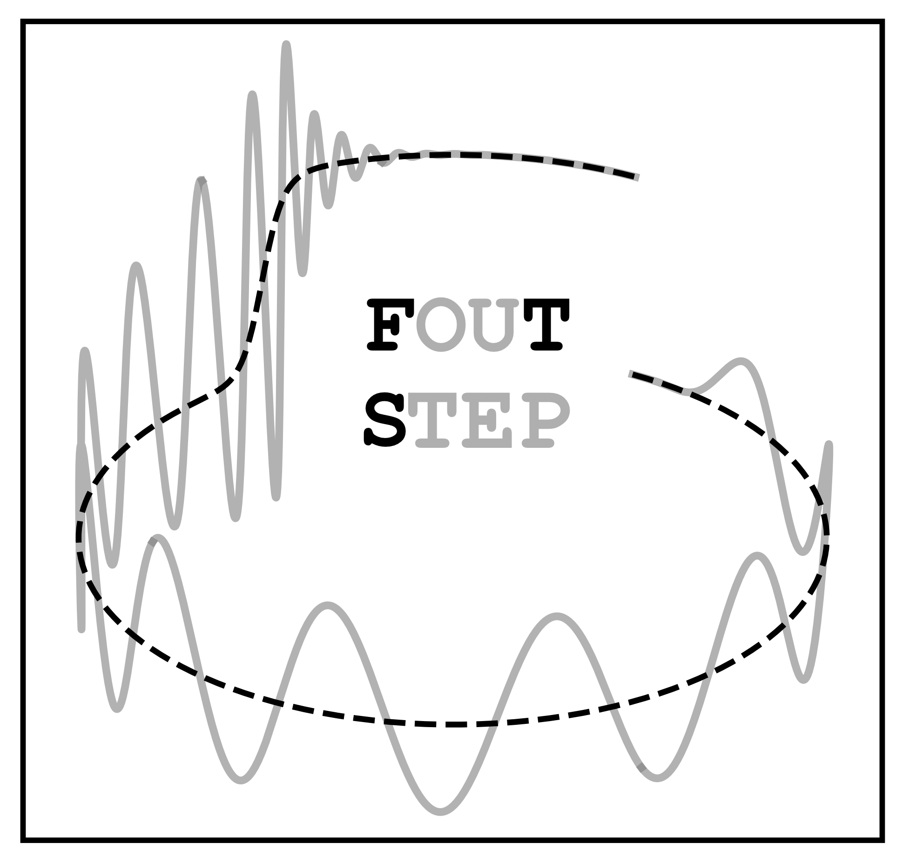

# gw-foutstep

[](https://arxiv.org/abs/2406.16636)
[](https://badge.fury.io/py/foutstep)


Implements the method of [J. Valencia et al. (2024)](https://journals.aps.org/prd/abstract/10.1103/PhysRevD.110.124026)
to compute Fourier transforms of discrete data with step-like behaviors.

## Installation steps

`gw-foutstep` is available in PyPI. Please, use the following command to install it
using `pip`:
```
$ pip install foutstep
```

## Citing this work

If this package has been useful for you work, please cite the following paper:
```
@article{PhysRevD.110.124026,
  title = {Frequency-domain analysis of gravitational-wave memory waveforms},
  author = {Valencia, Jorge and Tenorio, Rodrigo and Rossell\'o-Sastre, Maria and Husa, Sascha},
  journal = {Phys. Rev. D},
  volume = {110},
  issue = {12},
  pages = {124026},
  numpages = {16},
  year = {2024},
  month = {Dec},
  publisher = {American Physical Society},
  doi = {10.1103/PhysRevD.110.124026},
  url = {https://link.aps.org/doi/10.1103/PhysRevD.110.124026}
}
```
